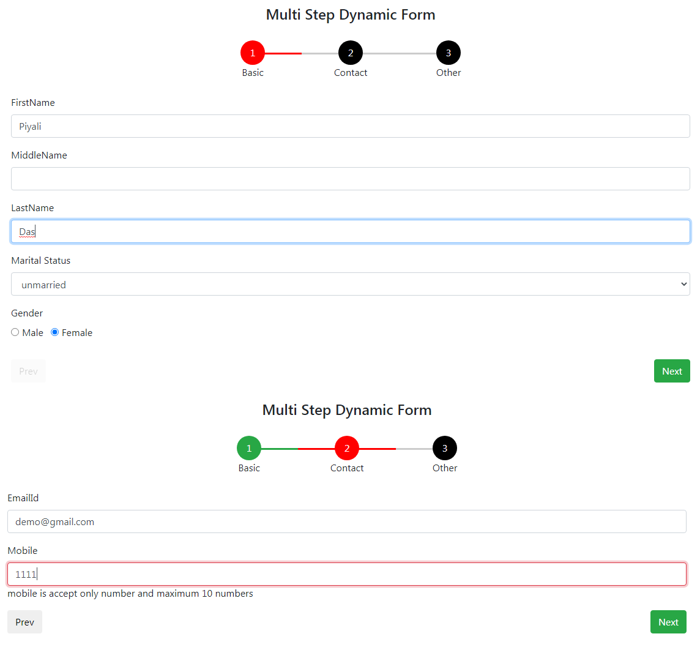
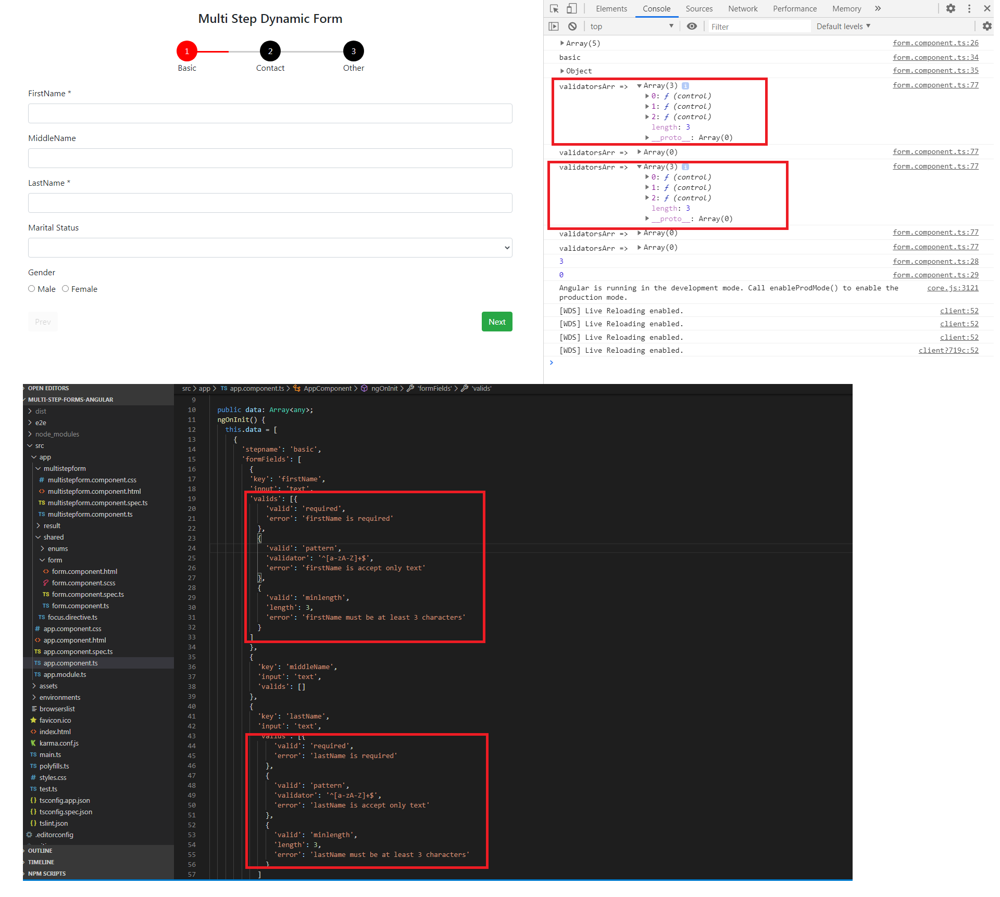

# Multi Step Dynamic Form in Angular
Passing formname, form fields, step details to create dynamic multi step form with prev/next button
1. Save button should be clicked to save data
2. Click on prev button to go previous form with already submitted value
3. At last step, you will get submit button instead of next to save total data

### Run the application
```
ng serve
localhost:4200
```



### App Component
static JSON file

```
this.data = [
      {
        'stepname': 'basic',
        'formFields': [
          {
          'key': 'firstName',
          'input': 'text',
          'valids': [{
              'valid': 'required',
              'error': 'firstName is required'
            },
            {
              'valid': 'pattern',
              'validator': '^[a-zA-Z]+$',
              'error': 'firstName is accept only text'
            },
            {
              'valid': 'minlength',
              'length': 3,
              'error': 'firstName must be at least 3 characters'
            }
          ]
          },
          {
            'key': 'middleName',
            'input': 'text',
            'valids': []
          },
          {
            'key': 'lastName',
            'input': 'text',
            'valids': [{
                'valid': 'required',
                'error': 'lastName is required'
              },
              {
                'valid': 'pattern',
                'validator': '^[a-zA-Z]+$',
                'error': 'lastName is accept only text'
              },
              {
                'valid': 'minlength',
                'length': 3,
                'error': 'lastName must be at least 3 characters'
              }
            ]
          },
          {
            'key': 'marital status',
            'input': 'select',
            'items': [{
                'name': 'married',
                'id': 0
              },
              {
                'name': 'unmarried',
                'id': 1
              }
            ],
            'valids': []
          },
          {
            'key': 'gender',
            'input': 'radio',
            'items': [{
                'name': 'male',
                'id': 0
              },
              {
                'name': 'female',
                'id': 1
              }
            ],
            'valids': []
          }
        ]
      },
      {
        'stepname': 'contact',
        'formFields': [
          {
            'key': 'emailId',
            'input': 'email',
            'valids': [{
                'valid': 'required',
                'error': 'emailId is required'
              },
              {
                'valid': 'emailId',
                'error': 'emailId must be valid'
              }
            ]
          },
          {
            'key': 'mobile',
            'input': 'text',
            'valids': [{
                'valid': 'required',
                'error': 'mobile is required'
              },
              {
                'valid': 'pattern',
                'validator': '^[0-9]{10}$',
                'error': 'mobile is accept only number and maximum 10 numbers '
              }
            ]
          },
        ]
      },
      {
        'stepname': 'other',
        'formFields': [
          {
            'key': 'country',
            'input': 'text',
            'valids': [{
                'valid': 'required',
                'error': 'country is required'
              },
            ]
          },
          {
            'key': 'state',
            'input': 'text',
            'valids': [{
                'valid': 'required',
                'error': 'state is required'
              },
            ]
          }
        ]
      }
    ];
```

### Multistepform component
Passing all details though the form component

```
<app-form *ngIf="stepItems && startingIndex < countSteps"
    [countSteps]="countSteps"
    [stepNo]="startingIndex"
    [formFields]="data[startingIndex].formFields"
    [formValues]="formValues"
    [stepName]="data[startingIndex].stepname"
    (formData)="getFormData($event)"
    (newStep)="onnewStep($event)"
    ></app-form>
```

### Form component
Dynamically form is generating regarding passsing values from multistepform component

```
<form [formGroup]="formName" #formDir="ngForm" appFocus (ngSubmit)="formDir.form.valid && submit(formDir)">
<div class="row" *ngFor="let form of formFields; let i = index">
    <div class="col-12 form-group" *ngIf="form.input == 'text'">
      <label>{{form.key}}
        <span class="required" *ngIf="formName.get(form.key).hasError('required')">*</span>
      </label>
      <input [type]="form.input" [formControlName]="form.key" class="form-control" [ngClass]="{'is-invalid' : formName.get(form.key).errors && formDir.submitted }">
      <div *ngIf="!formName.get(form.key).valid && formName.get(form.key).errors && formDir.submitted">
        <div *ngFor="let err of form.valids; let k = index">
          <span class="error" *ngIf="formName.get(form.key).hasError(err.valid)">{{err.error}}</span>
        </div>
      </div>
    </div>
    <div class="col-12 form-group" *ngIf="form.input == 'email'">
      <label>{{form.key}}
        <span class="required" *ngIf="formName.get(form.key).hasError('required')">*</span>
      </label>
      <input [type]="form.input" [formControlName]="form.key" class="form-control" [ngClass]="{'is-invalid' : formName.get(form.key).errors && formDir.submitted }">
      <div *ngIf="!formName.get(form.key).valid && formName.get(form.key).errors && formDir.submitted">
        <div *ngFor="let err of form.valids; let k = index">
          <span class="error" *ngIf="formName.get(form.key).hasError(err.valid)">{{err.error}}</span>
        </div>
      </div>
    </div>
    <div class="col-12 form-group" *ngIf="form.input == 'password'">
      <label>{{form.key}}
        <span class="required" *ngIf="formName.get(form.key).hasError('required')">*</span>
      </label>
      <input [type]="form.input" minlength="3" [formControlName]="form.key" class="form-control" [ngClass]="{'is-invalid' : formName.get(form.key).errors && formDir.submitted }">
      <div *ngIf="!formName.get(form.key).valid && formName.get(form.key).errors && formDir.submitted">
        <div *ngFor="let err of form.valids; let k = index">
          <span class="error" *ngIf="formName.get(form.key).hasError(err.valid)">{{err.error}}</span>
        </div>
      </div>
    </div>
    <div class="col-12 form-group" *ngIf="form.input == 'select'">
      <label>{{form.key}}
        <span class="required" *ngIf="formName.get(form.key).hasError('required')">*</span>
      </label>
      <select [formControlName]="form.key" class="form-control" [ngClass]="{'is-invalid' : formName.get(form.key).errors && formDir.submitted }">
        <option *ngFor="let item of form.items; let j = index" [value]="item.id" [selected]="formValues[form.key]">
          {{item.name}}
        </option>
      </select>
      <div *ngIf="!formName.get(form.key).valid && formName.get(form.key).errors && formDir.submitted ">
        <div *ngFor="let err of form.valids; let k = index">
          <span class="error" *ngIf="formName.get(form.key).hasError(err.valid)">{{err.error}}</span>
        </div>
      </div>
    </div>
    <div class="col-12 form-group" *ngIf="form.input == 'radio'">
      <label>{{form.key}}
        <span class="required" *ngIf="formName.get(form.key).hasError('required')">*</span>
      </label>
      <div class="form-group">
        <div class="form-check-inline" *ngFor="let item of form.items; let j = index">
          <label class="form-check-label">
            <input [type]="form.input" class="form-check-input" [formControlName]="form.key" [value]="item.id"
              [ngClass]="{'is-invalid' : formName.get(form.key).errors && formDir.submitted }" name="form.key" [checked]="formValues[form.key]">{{item.name}}
          </label>
        </div>
        <div *ngIf="!formName.get(form.key).valid && formName.get(form.key).errors && formDir.submitted">
          <div *ngFor="let err of form.valids; let k = index">
            <span class="error" *ngIf="formName.get(form.key).hasError(err.valid)">{{err.error}}</span>
          </div>
        </div>
      </div>
    </div>
    <div class="col-12 form-group" *ngIf="form.input == 'checkbox'">
      <label>{{form.key}}
        <span class="required" *ngIf="formName.get(form.key).hasError('required')">*</span>
      </label>
      <div class="form-group">
        <div class="form-check-inline" *ngFor="let item of form.items; let j = index">
          <label class="form-check-label">
            <input [type]="form.input" class="form-check-input" [formControlName]="form.key" [value]="item.id"
              [ngClass]="{'is-invalid' : formName.get(form.key).errors && formDir.submitted }" name="form.key" [checked]="formValues[form.key]">{{item.name}}
          </label>
        </div>
        <div *ngIf="!formName.get(form.key).valid && formName.get(form.key).errors && formDir.submitted">
          <div *ngFor="let err of form.valids; let k = index">
            <span class="error" *ngIf="formName.get(form.key).hasError(err.valid)">{{err.error}}</span>
          </div>
        </div>
      </div>
    </div>
  </div>
  <div class="row">
    <div class="col-6 form-group text-left">
      <button type="button" class="btn btn-default" [disabled]="stepNo === 0" (click)="gotoStep(stepNo-1)">Prev</button>
    </div>
    <div class="col-6 form-group text-right">
      <button type="submit" *ngIf="stepNo !== countSteps - 1" class="btn btn-success">Next</button>
      <button type="submit" *ngIf="stepNo === countSteps - 1" class="btn btn-success">Submit</button>
    </div>
  </div>
  </form>
```

### formDir.form.valid && submit(formDir) - form will be submitted when form is valid and button type should be submit.

```
submit(myForm: NgForm) {
	    console.log('Form details => ', this.formName.value);
	      const obj = Object.assign(this.formName.value, {'formName': this.stepName});
	      this.formData.emit(obj);
	      this.newStep.emit(this.stepNo + 1);
	      myForm.resetForm();
	  }
```

### submit function is calling while submitting the form. Form value is emitting to the multi step component and step no is increasing to emit also. With increasing step no, next form will be generated.
createForm function is using to create the form with respective formName.

```
createForm() {
	    this.formName = new FormGroup({});
	    if (this.formName && Object.keys(this.formValues).length > 0) {
	      console.log(this.formName);
	      setTimeout(() => {
	        this.formName.patchValue(this.formValues);
	      }, );
	    }
	    this.validateForm();
	  }
```



See in this image, for FirstName and LastName we are getting 3 validatorArr because from JSON data we are passing 3 valids array.

### Creating this validation error checking functionality using the validateForm method,

```
validateForm() {
    this.formFields.forEach(element => {
      const validatorsArr: ValidatorFn[] = [];
      if (element.valids.length > 0) {


        element.valids.forEach(val => {
          if (val.valid === 'required' || val.valid === 'email') {
            validatorsArr.push(Validators[val.valid]);
          }
          if (val.valid === 'pattern') {
            validatorsArr.push(
              Validators.pattern(val.validator)
            );
         }
         if (val.valid === 'minlength') {
            validatorsArr.push(
              Validators.minLength(val.length)
            );
          }
        });


        this.formName.addControl(element.key, new FormControl('', validatorsArr));
      } else {
        this.formName.addControl(element.key, new FormControl(''));
      }
      console.log('validatorsArr => ', validatorsArr);
    });
  }
```


